# Avocado Project

## Problem Statement

My goal is to create a model to determine avocado prices given certain specs. I want to find what conditions give us the most profit. Meaning highest price times highest volume.

## The Data

I am using the kaggle data set found in https://www.kaggle.com/datasets/neuromusic/avocado-prices?resource=download.

## Cleaning 

There isn't much to clean as there were no null values. All I did was remove the extra Unnamed: 0 columne and convert the dates to date time.

## Exploratory Data Analysis

The mean values for all the columns are:

AveragePrice         1.405978
Total Volume    850644.013009
4046            293008.424531
4225            295154.568356
4770             22839.735993
Total Bags      239639.202060
Small Bags      182194.686696
Large Bags       54338.088145
XLarge Bags       3106.426507
year              2016.147899

Something that I would like to explore is the relationship between average price and total volume. With the theory of supply and demand, we should expect there to be a relation where as value goes up, price goes down. Let us see if that holds.

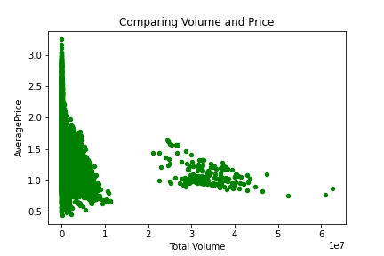

While the trend isn't too strong, we do see a slight confimation of the theory. As the volume increases, the price of Avocados.

We are given 3 PLU numbers. The PLU number for an avocado indicates to retailers what type of avocados are being sold. We have PLU numbers of 4046, 4225, and 4770.

For reference: 4046: 3-5 oz, 4225: 8-10 oz, 4770: 10-15 oz,

Read more about it here: https://loveonetoday.com/how-to/identify-hass-avocados/

Given this information, I would like to make a new column called total_oz. In total_oz, I will add 4 for every 4046 avocado, 9 for every 4225 avocado, and 12.5 for every 4770 avocado. I will then compare this column to price and volume to see if there is any correlation.

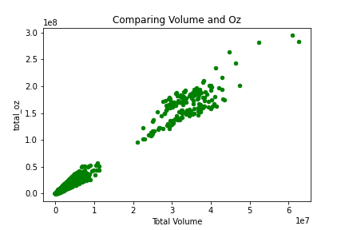

Not surprisingly, we see a strong corellation between volume and total_oz

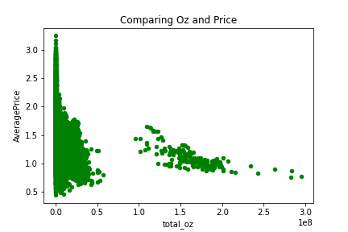

We see a similar trend here as we did when comparing price and volume.

Next we have total bags, small bags, large bags, and XL bags. We would expect the more bags there are, the greater the volume is. This should be even more so the case with XL bags. Let's quickly compare bags with volume and price.

Starting with volume

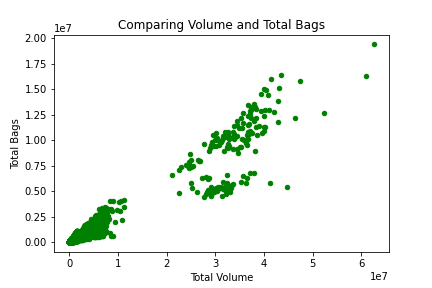
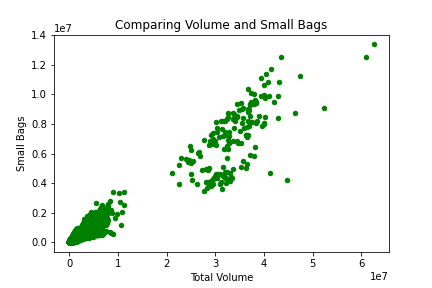
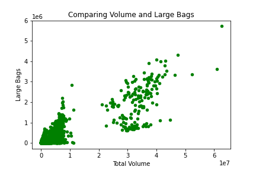

Not surprisingly, the more bags there are, the higher the volume. What is surprising however, is that as the bags increase in size, the correlation between number of bags and volume becomes less clear.

What this tells me is that the majority of bags are small bags. This becomes evident in the fact that the chart comparing volume with total bags is almost the same as the chart comparing volume with small bags.

Now is time to compare bags with price.

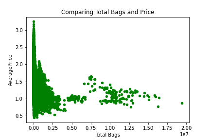
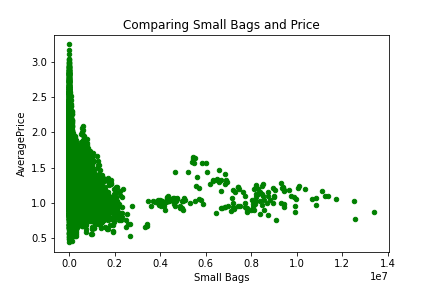
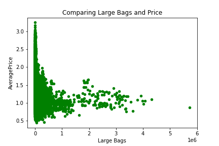
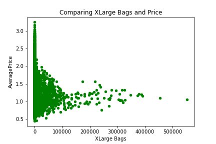

There doesn't seem to be a correlation between bag count and avocado price.

We are given the dates so I want to see how season effects avocado volume and price.

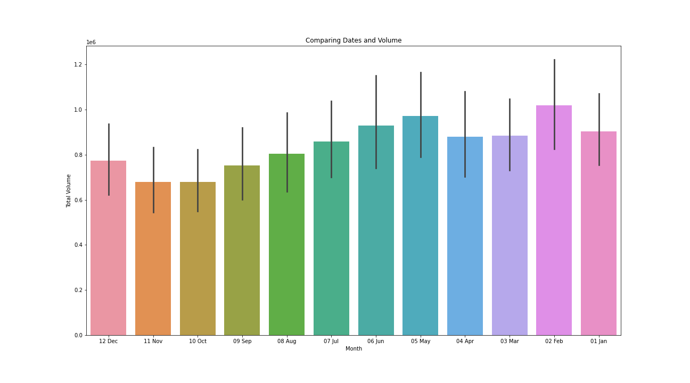

This charts shows the months of the year in backwars order. We see that the volume yield is lowest in the fall and highest in the spring time (also in February)

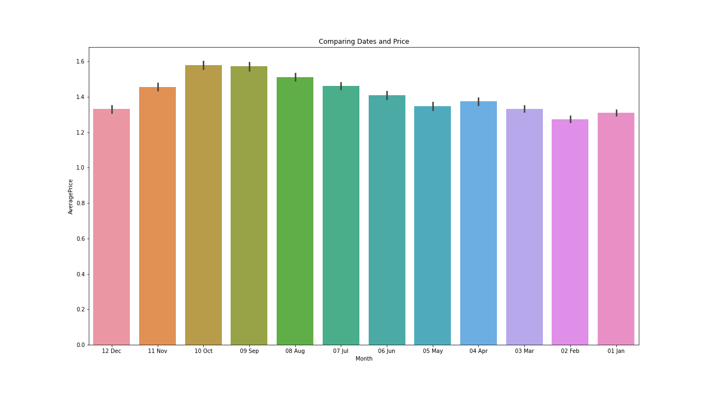

Not surprisingly, as the yield of avocados decrease in the fall months, the price of avocados increases.

We are given the type and the region for the avocados. The type just tells us if the Avocados are organic or not. The region tells us which region the avocados were sold.

Because of outlier data, I zoomed into volumes of 500000 or less.

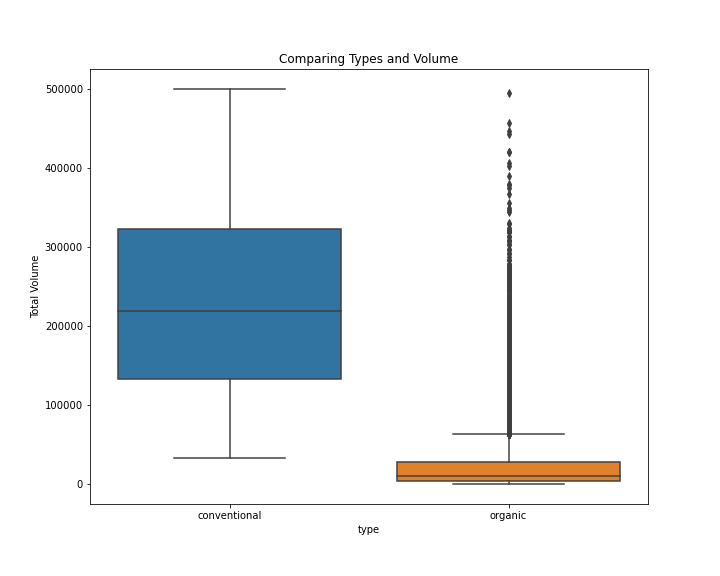

As we can see, the conventional avocados typically yield a bigger yield than the organic ones. This in turn should mean that the organic avocados should be priced higher. Let's see

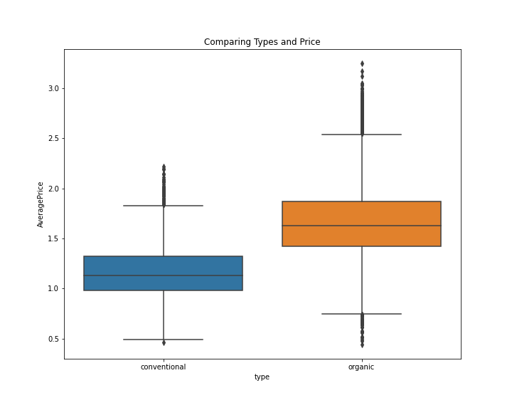

This confirms that indeed, organic avocados generally more expensive than nonorganic avocados.

When looking at the regions, there were too many. So I grouped many of them together into super-regions and compared the new super-regions together. One of the groups was TotalUS which I got rid of because it through off our data. But without the TotalUS, here is what we got:

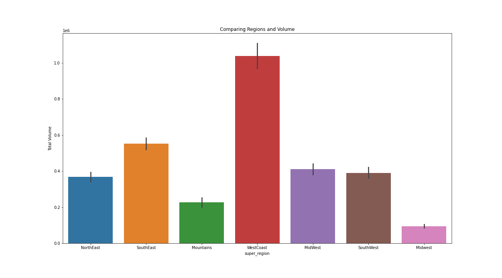

We see that the west coast buys the most avocados and that they almost double the second place super region (south east). The midwest buys the least amount of avocados

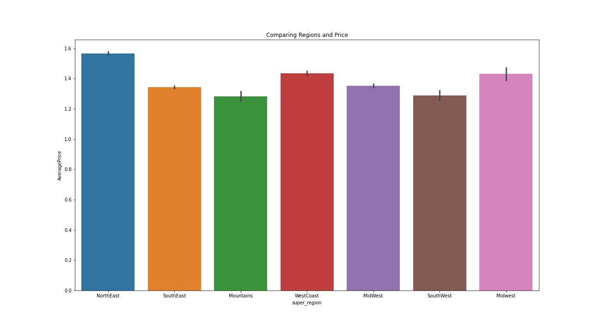

The price doesn't seem to change much region to region. Although, the North East is the super region with the highest priced avocados.

The last bit of exploratory data I want to look at is a heatmap. To do this though we need a metric to compare too.

Since we are trying to find price times volume, I will make a new column called revenue that finds just that. I will make a heatmap afterwords that looks to compare variables to this metric.

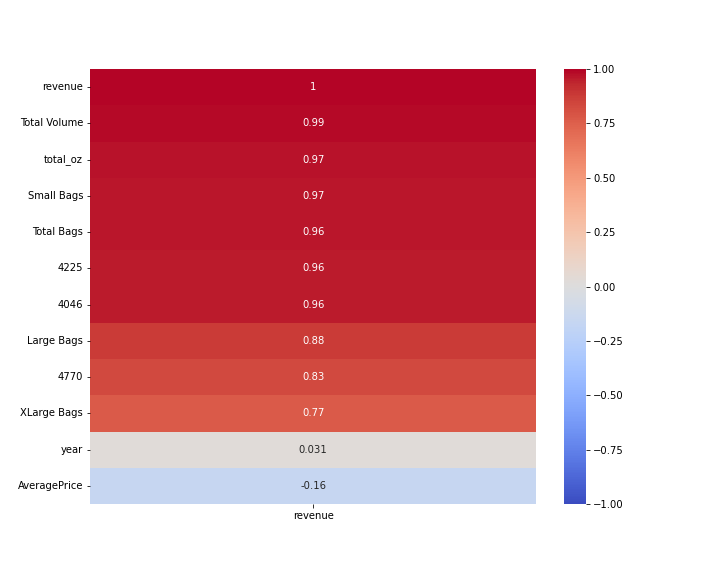

We see some remarkable findings here. First off, Total Volume is extreamly correlated with revenue while average price doesn't have much or a correlation. That means volume needs to be high, and it doesn't matter the price we sell them at.

Also we see huge correlation with total_oz, small bags, total bags, 4225 and 4046. And while not as huge, there is still a large correlated value in revenue with large bags, 4770, and XLarge Bags.

## Modelling

Before constructing the model, I want to include the super region, months, and type into the equation. As mentioned before, the TotalUS throughs everything off, so I will discard it. Besides that I will make dummy variables for these 3 columns and make another heat map. Afterwords I will work on my model.

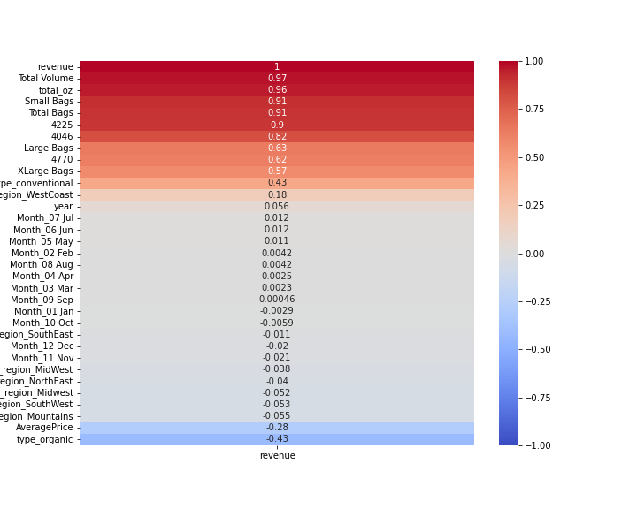

Seems that the regions and months don't have a strong correlation to revenue. Interestingly, conventional avocados increase revenue while organic ones decrease it.

I created my X variable with these columns ['Total Volume', 'total_oz', 'Small Bags', 'Total Bags', '4225'] and a degree 2 polynomial. The y value is revenue. I made a linear regression model. Here is the R^2 score of the model:

Training R2: 0.9674007936674592
Testing R2: 0.9601790654220247

The model shows that to maximize revenue, we should grow as many 4225 (8-10 oz) avocados as possible, and ship them in small bags. This gives us an R^2 score of 96.0% and isn't over or under fit.

Finally, we need to find out what price to sell the avocados at. I'll make another linear regression model to do that. But first let us create another heat map to see what correlates with price.

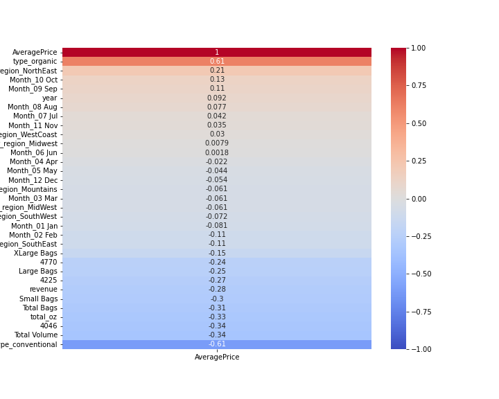

The main indicator of high price seems to be wheather or not the avocado is organic (organic raises the price)

I created my X variable with these columns ['type_organic', 'type_conventional', 'Total Volume', '4046', 'total_oz', 'Total Bags', 'Small Bags', '4225', 'Large Bags', '4770', 'super_region_NorthEast', 'XLarge Bags', 'Month_10 Oct'] and a degree 2 polynomial. I purposely excluded the revenue as it is impossible to know what that is without the price that we are trying to find.The y value is AveragePrice. I made a linear regression model. Here is the R^2 score of the model:

Training R2: 0.490479504692509
Testing R2: 0.47855765487960833

This model isn't as accurate as the last model. It only has an R^2 of 47.9%. Still, it isn't over or under fit.

What it tells us is that we should sell organic avocados at a higher price than nonorganic ones, that the higher the volume of avocados, the lower the price, that we sell them at a higher price in the north east, and finally, that the month of October increases price on avocados.

## Conclusion

My proposal is that we put all of our effort into growing as high volume of 4225 (8-10 oz) avocados as posible and to ship them in small bags. This will increase revenue for the company as well as bring down cost for the customer

Going forword, I would like information on the cost of growing avocados. Given this set of information, I was only able to calculate revenue. However, to find the profit margin, we need both revenue and cost.